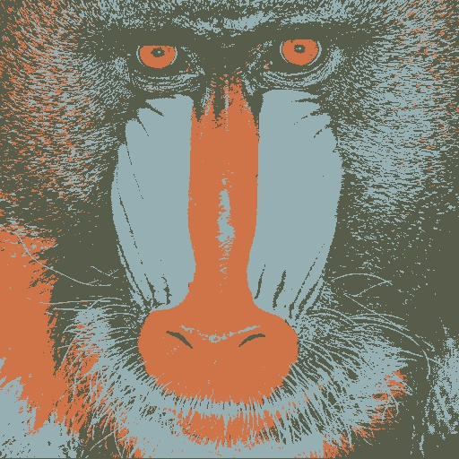
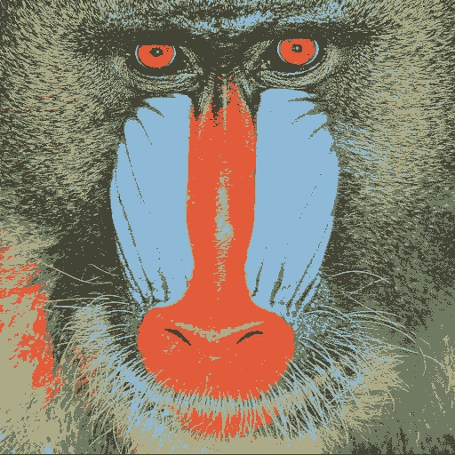
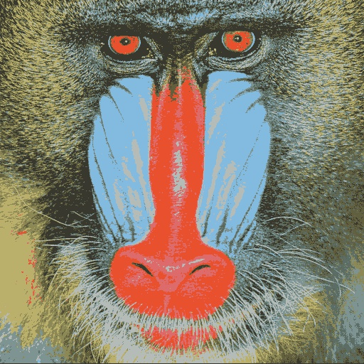
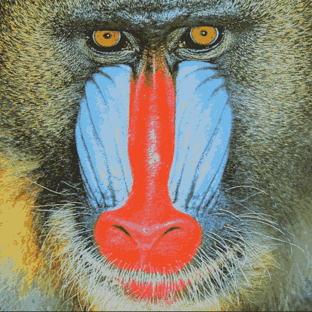

# Color-Ouantization using K-Means
Coloring an image with 'K' Colors using K-Means Coloring. Here we implement K-Means Clustering by using only basic Numpy operations and opencv.imread() to perform Color Quantization on an Image. 

## Color Quantization Definition :
It refers to reducing the number of colors used to represent an image. We color the image in 'k' number of colors by using K-Means Clustering. 

## Flow of Code :
1.  Take an input image with the desired number of colors (k) and add the threshold of when to stop updating.
2.  Randomly initialize the centers of the Clusters. 
3.  Calculating distance of each point w.r.t each Centroid and Classifing the Points to the corresponding Centroid.
4.  Store all points in terms of the Centroid to which they are assigned.
5.  Recompute the Mean of each Centroid
6.  Paint the image with the Mu value of each Cluster to the corresponding pixel value.

## Example :
We consider an image as below and apply the program on this image to color the image with 3, 5, 10 and 20 colors.

    
  
  <figcaption>
Baboon (Original Image)
</figcaption>

    
  
  <figcaption>
3 Colors
</figcaption>

    
  
  <figcaption>
5 Colors
</figcaption>

    
  
  <figcaption>
10 Colors
</figcaption>

    
  
  <figcaption>
20 Colors
</figcaption>

  
  
